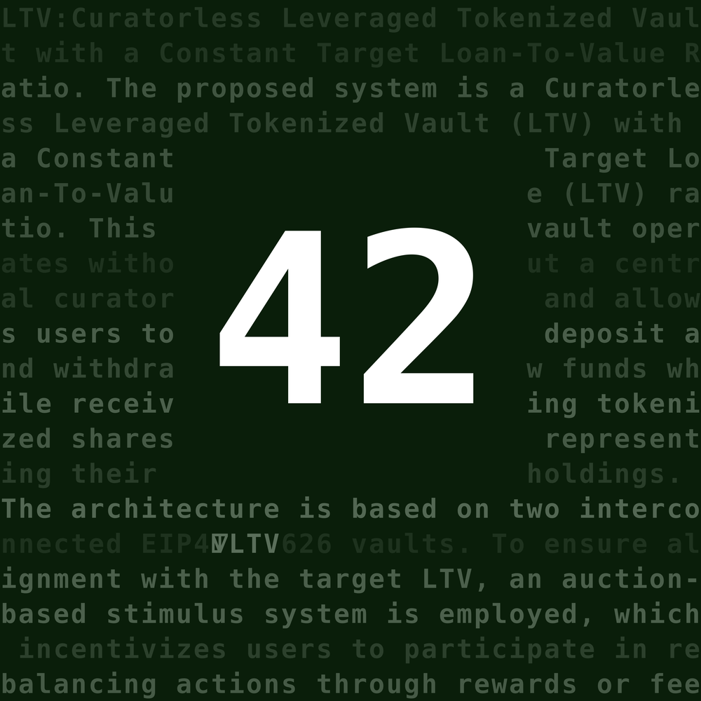
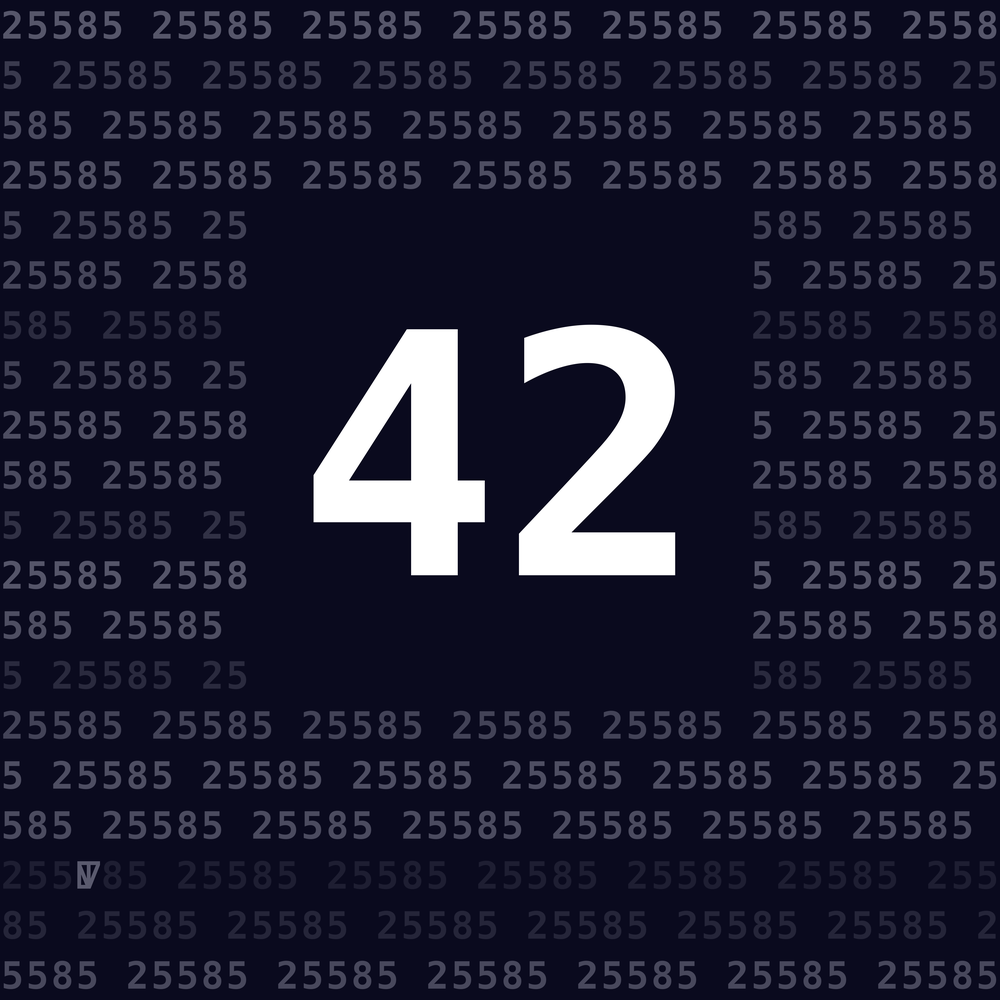

# 42

42. A curatorless NFT collection.

A non-upgradable **ERC-721** collection with an on-chain **`baseMetadataURI`** pointing to **IPFS**. Built with **Foundry**. 

**Features:**
- ERC-721 with immutable `baseMetadataURI` set at deploy time
- Limited supply (**1024** maximum)
- Fixed mint fee
- Whitelist only

## Collection Preview

| 0 | 1 | 2 | 3 |
|---|---|---|---|
|  |  |  |  |
| 4 | 5 | 6 | 7 |
|  |  |  |  |
| 8 | 9 | 10 | 11 |
|  |  |  |  |
| 12 | 13 | 14 | 15 |
|  |  |  |  |

## IPFS CIDs

- **Mainnet metadata CID:** `QmXTn6YvXZgNmNzyBN19RgYgpG6YeZNnTwo1zWbHSb8x5b`
- **Sepolia metadata CID:** `QmbtxQySbQcGxMUxofMhoxdevKeQMjE9i6xuWsSoLnJbrw`
- **Content supply:** mainnet `1..1024`, sepolia `1..128`
- **Token URI shape:** `ipfs://<metadataCID>/<tokenId>`

---

## IPFS pipeline

1. **Upload images** (recursive):
   ```bash
   cd content/mainnet/images
   ipfs add -r .
   # Save CID if you reference images by their own tree
   ```

2. **Upload metadata** (recursive):
   ```bash
   cd content/mainnet/metadata
   ipfs add -r .
   # This CID becomes your baseMetadataURI
   ```

3. **Upload images for Sepolia** (recursive):
   ```bash
   cd content/sepolia/images
   ipfs add -r .
   # Save CID if you reference images by their own tree
   ```

4. **Upload metadata for Sepolia** (recursive):
   ```bash
   cd content/sepolia/metadata
   ipfs add -r .
   # This CID becomes your baseMetadataURI for Sepolia
   ```

---

## Build & test

```bash
forge build
forge test -vv
```

---

## Deploy & verify

### Export your environment variables:

```bash
export RPC_URL=""
export ETH_FROM="0xYourDeployer"
export PRIVATE_KEY="0xYourPrivateKey"
export ETHERSCAN_API_KEY="..."

# MintGuard deployment parameters
export FEE="42000000000000000" # 0.042
export VOUCHER_SIGNER="0xYourSigner"
export PROXY_OWNER="0xYourProxyOwner"
export MINT_GUARD_OWNER="0xYourMintGuardOwner"

# NFT42 deployment parameters
export BASE_METADATA_URI="ipfs://QmYourMetadataCID/"  # Your IPFS metadata CID
export MAX_TOKENS="1024"                              # Maximum number of tokens
export MINT_GUARD_ADDRESS="0xYourMintGuardAddress"    # Set after MintGuard deployment
```

### Deploy MintGuard first

```bash
# Deploy MintGuard
forge script script/DeployMintGuard.s.sol \
  --rpc-url $RPC_URL --broadcast \
  --verify --sender $ETH_FROM --private-key $PRIVATE_KEY --etherscan-api-key $ETHERSCAN_API_KEY

# Update MINT_GUARD_ADDRESS with the deployed address
export MINT_GUARD_ADDRESS="0xDeployedMintGuardAddress"
```

### Deploy NFT42

```bash
# Deploy NFT42
forge script script/DeployNFT42.s.sol \
  --rpc-url $RPC_URL --broadcast \
  --verify --sender $ETH_FROM --private-key $PRIVATE_KEY --etherscan-api-key $ETHERSCAN_API_KEY
```

### Sign Voucher

To create a voucher for minting, use the signing script:

```bash
# Generate the voucher signature
forge script script/SignVoucher.s.sol --rpc-url $RPC_URL
```

### Mint with Voucher

To both generate the voucher and send the mint transaction:

```bash
# Mint NFT using voucher (generates signature and sends transaction)
forge script script/MintWithVoucher.s.sol \
  --rpc-url $RPC_URL --broadcast \
  --sender $ETH_FROM --private-key $PRIVATE_KEY
```

This script will generate the voucher signature and automatically send the mint transaction with the correct fee.

## Sepolia Deployment

- **NFT42:** [0xF7f7996ce30179CDe83699417D49F405d742c0F1](https://sepolia.etherscan.io/address/0xF7f7996ce30179CDe83699417D49F405d742c0F1)  
- **MintGuard:** [0xb0cbda6f91a0d9215db1b7e662ba31c8b312cc54](https://sepolia.etherscan.io/address/0xb0cbda6f91a0d9215db1b7e662ba31c8b312cc54)  

Contracts deployed and verified on Sepolia for testing.  
Use Sepolia metadata CID for token URIs and content range (`1..128`).  

## Links

- **Website**: [LTV](https://ltv.finance)
- **Repository**: [GitHub Repository](https://github.com/ltvprotocol/ltv_v0)
- **Documentation**: [Protocol Documentation](https://docs.ltv.finance)
- **Twitter**: [@ltvprotocol](https://x.com/ltvprotocol)